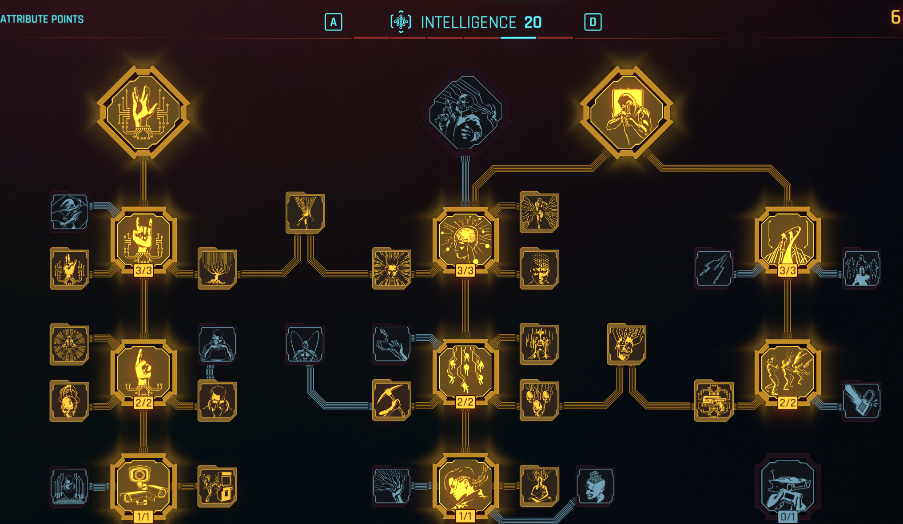
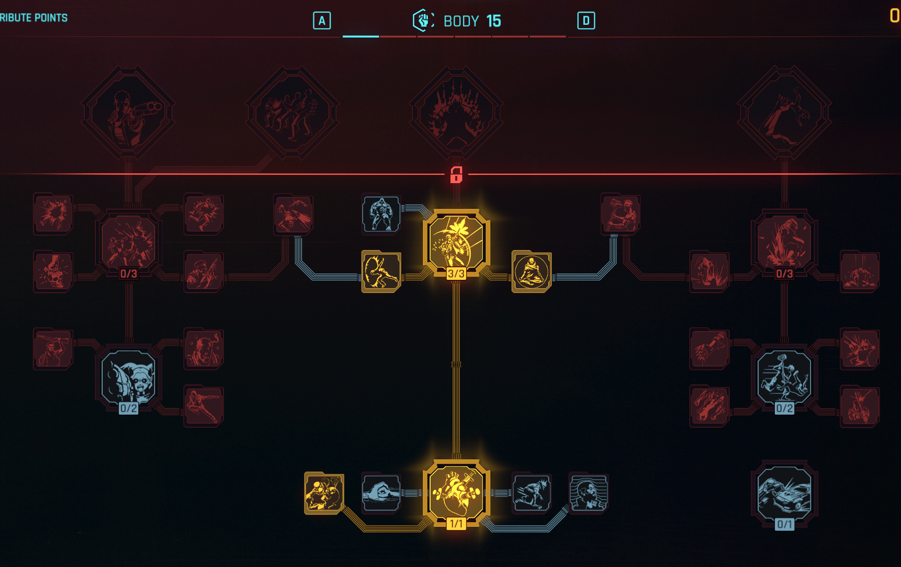
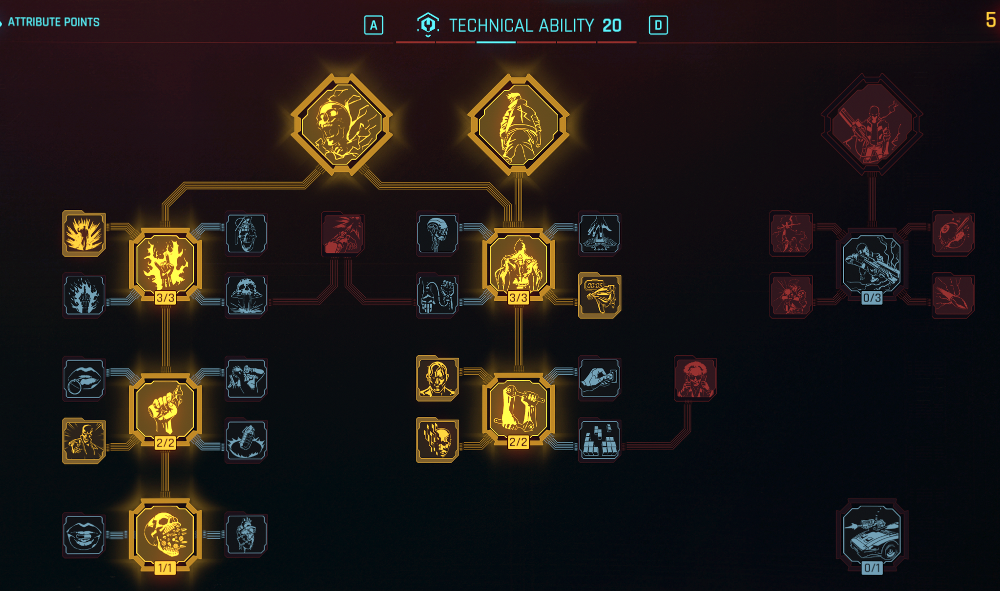
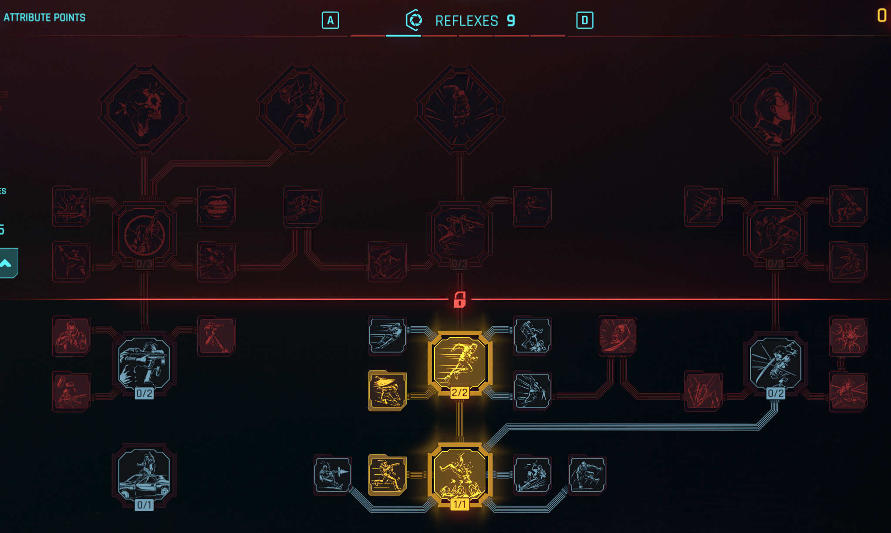
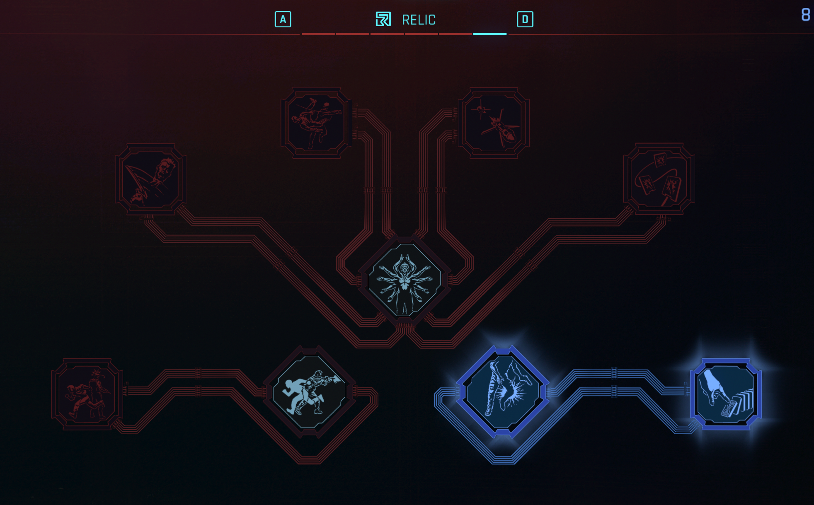

# Guia Completo: Build Netrunner (Trilha-Rede) — Cyberpunk 2077

> Atualizado para o Patch 2.31 (versão mais recente do jogo). Válido para PS5, PS5 Pro, Xbox Series e PC.
> Passado utilizado: Corporativo (Corpo). Inclui Phantom Liberty, com alternativa para quem não tem a DLC.
> Fontes principais: Gamestegy, Game8 e patch notes oficiais da CD Projekt RED. Links no final.

---

## 1. Visão geral da build

O Netrunner é a build de hacker puro: você mata, cega, queima e explode inimigos sem nem sacar a arma, usando hacks rápidos (quickhacks) alimentados por RAM. Desde o update 2.0 a mecânica central é a **fila de quickhacks** (queue): você empilha vários hacks no mesmo alvo e eles detonam em cadeia, com bônus de dano por combo.

O coração da build no late game é o **Overclock** (perk final de Inteligência), que permite gastar **vida** no lugar de RAM. Combinado com os perks certos, você entra num loop quase infinito de hacks.

**Pontos fortes:** controle total do campo de batalha, stealth absoluto, dano absurdo em área, trivializa chefes e câmeras/torretas viram suas aliadas.
**Pontos fracos:** início de jogo mais lento (pouca RAM), frágil se cercado no corpo a corpo antes dos cyberwares defensivos.

---

## 2. Passado Corporativo (Corpo)

Boa notícia: **o passado não afeta em nada os atributos ou a força da build**. A escolha muda apenas:

- A missão de prólogo (você começa na Arasaka Tower como agente da contrainteligência).
- Opções de diálogo exclusivas `[Corporativo]` ao longo do jogo, úteis para manipular executivos, agentes e situações corporativas. Tematicamente é o passado que mais combina com Netrunner: você entende o sistema por dentro.
- Nenhum bônus ou penalidade de gameplay. Pode seguir este guia 100%.

---

## 3. Atributos

### 3.1 Criação de personagem (7 pontos para distribuir, máx. 6 por atributo)

| Atributo | Valor inicial | Pontos gastos |
|---|---|---|
| Inteligência | **6** | +3 |
| Corpo | **6** | +3 |
| Habilidade Técnica | **4** | +1 |
| Reflexos | 3 | 0 |
| Frieza | 3 | 0 |

Inteligência 6 libera os primeiros perks de quickhack imediatamente. Corpo 6 dá sobrevivência cedo (Analgésico / Painkiller). Técnica 4 abre o caminho dos perks de cyberware.

### 3.2 Distribuição final (nível 60, com Phantom Liberty, 81 pontos)

| Atributo | Final | Função na build |
|---|---|---|
| **Inteligência** | **20** | Tudo: RAM, dano de hack, fila, Overclock. Prioridade absoluta. |
| **Habilidade Técnica** | **20** | Capacidade de cyberware, perk Edgerunner, bônus de chrome. |
| **Corpo** | **15** | Vida e regeneração (essencial para sustentar o Overclock, que consome HP). |
| **Reflexos** | **9** | Dash e mobilidade básica. |
| **Frieza** | **3 a 10** | Opcional. Suba para 10 se quiser mais stealth (árvore Ninjutsu). |

> **Sem Phantom Liberty (nível 50, 71 pontos):** Inteligência 20, Habilidade Técnica 20, Corpo 12 a 15, Reflexos 9, Frieza 3. A lógica é a mesma, só sobram menos pontos.

> **Variante do Game8 (mais stealth):** Inteligência 20, Reflexos 15, Técnica 15, Frieza 15, Corpo 16. Funciona bem, mas a versão acima (Gamestegy) entrega mais dano de combo e mais sustain de Overclock. Escolha uma e siga até o fim, o respec de atributos só pode ser feito **uma vez** por save.

### 3.3 Ordem de evolução

1. **Níveis 1 a 15:** Inteligência até 15 primeiro. Pegue Corpo 6 se não pegou na criação.
2. **Níveis 15 a 25:** Inteligência 20 (libera Overclock). Depois comece Habilidade Técnica.
3. **Níveis 25 a 40:** Habilidade Técnica 20 (libera Edgerunner). Corpo até 15 no caminho.
4. **Níveis 40 a 60:** Reflexos 9, resto em Frieza ou Corpo a gosto.

---

## 4. Perks por árvore

As imagens abaixo são screenshots reais da distribuição final (fonte: Gamestegy, patch 2.x).

### 4.1 Inteligência (árvore principal)

Ordem de aquisição por requisito de atributo. Nomes em inglês com tradução aproximada da localização PT-BR entre parênteses.

**Inteligência 4:**
- Eye in the Sky (Olho no Céu): controle de câmeras
- Warning: Explosion Hazard (Aviso: Perigo de Explosão)
- Optimization (Otimização): reduz custo de RAM
- Encryption (Criptografia)
- Subordination (opcional, para torretas/robôs)

**Inteligência 9:**
- Embedded Exploit (Exploit Embutido): **chave da build**, hacks de combate causam mais dano em alvos com hack de controle ativo
- ICEpick: reduz custo de RAM
- System Overwhelm (Sobrecarga do Sistema)
- Speculation, Recirculation (Recirculação): **recupera RAM ao matar com arma smart**
- Acquisition Specialist, Precision Subroutines
- Hack Queue (Fila de Hacks): **libera a fila, essencial**
- Data Recycler, Feedback Loop, Counter-a-hack

**Inteligência 15:**
- **Overclock: o perk mais importante da build.** Permite hackear gastando vida quando a RAM acaba
- Sublimation, Race Against Mind, Power Surge
- Queue Acceleration (Aceleração de Fila) 3/3: +1 RAM, custo reduzido, +1 slot de fila e +60% velocidade de upload
- Queue Hack_Root, Queue Prioritization
- **Blood Daemon (Daemon de Sangue): recupera HP ao matar com quickhack, sustenta o Overclock**
- Target Lock Transfer

**Inteligência 20:**
- **Queue Mastery (Maestria de Fila): dano aumenta a cada hack na fila do alvo, é daqui que saem os combos de 10K+**
- Smart Synergy (Sinergia Smart): armas smart travam mira instantaneamente durante o Overclock

### 4.2 Corpo (sobrevivência)

**Corpo 4:** Painkiller (Analgésico), Dorph-head
**Corpo 15:** Adrenaline Rush (Adrenalina) 2/2, Juggernaut (Jagrená), Calm Mind

Por que importa: o Overclock consome HP. Mais vida e regeneração = mais hacks de graça.

### 4.3 Habilidade Técnica (cyberware)

**Técnica 4:** Glutton for War (Glutão de Guerra)
**Técnica 9:** All Things Cyber (Tudo Cyber), Renaissance Punk (Punk Renascentista), Chrome Constitution, Health Freak 2/2, Borrowed Time
**Técnica 15:** License to Chrome (Licença para o Chrome) 3/3, Extended Warranty (Garantia Estendida). Opcionais: Cyborg, Pyromania, Heat Shield
**Técnica 20:** **Edgerunner: +capacidade de cyberware acima do limite e buff ao ativar Overclock.** Opcional: Ticking Time Bomb

### 4.4 Reflexos (mobilidade)

**Reflexos 4:** Slippery (Escorregadio), Muscle Memory
**Reflexos 9:** **Dash (Arrancada)**, Can't Touch This

### 4.5 Relíquia (só com Phantom Liberty)

Prioridade:
1. **Vulnerability Analytics (Análise de Vulnerabilidade):** revela pontos fracos que dão crítico garantido
2. **Machine Learning (Aprendizado de Máquina):** detectar vulnerabilidades aumenta chance e dano crítico

O resto dos pontos de Relíquia vai em Emergency Cloaking (camuflagem) ou nos perks de braço a gosto.

---

## 5. Cyberware (visite o ripperdoc a cada ~10 níveis para subir tier)

### Sistema Operacional (o coração da build)

| Cyberdeck | Quando usar |
|---|---|
| **Tetratronic Rippler Mk.5** | **Recomendado.** Maior dano de combo, faz upload automático de Reboot Optics e Weapon Glitch ao ativar Overclock |
| Netwatch Netdriver Mk.1 | Alternativa para quem joga muito via câmeras (hacks em área via câmera) |
| Militech Paraline | Se quiser focar em armas smart |

### Prioridade 1 (compre primeiro)

| Slot | Cyberware | Efeito |
|---|---|---|
| Córtex Frontal 1 | **COX-2 Cybersomatic Optimizer** | Crítico garantido em quickhacks (caro, Tier 5++, mas transforma a build) |
| Córtex Frontal 2 | **Ex-Disk** | +5 RAM máx e +30% velocidade de upload |
| Rosto | Kiroshi "Sentry" Optics | Dano baseado em Inteligência |
| Mãos | Smart Link | Mira automática de armas smart |
| Sistema Circulatório 1 | Biomonitor | Cura automática em combate |
| Sistema Circulatório 2 | Blood Pump | Melhor item de cura do jogo |
| Esqueleto 1 | Spring Joints | Mitigação |
| Sistema Nervoso 1 | Neofiber | Chance de mitigação |
| Tegumentar 1 | Countershell | +50% força de mitigação |
| Pernas | Reinforced Tendons | Pulo duplo (movimentação e rotas de stealth) |

### Prioridade 2 (meio de jogo)

- Córtex Frontal 3: **Axolotl** (reduz cooldowns, incluindo Overclock) ou Newton Module
- Esqueleto 2: Epimorphic Skeleton (vida e armadura)
- Sistema Nervoso 2: Reflex Tuner ou Revulsor (salva-vidas com HP baixo)
- Tegumentar 2: Shock-N-Awe ou Painducer
- Tegumentar 3: Cogito Lattice ou **Optical Camo** (camuflagem ótica, stealth total)

### Prioridade 3 (final de jogo)

- Esqueleto 3: Kinetic Frame ou Bionic Joints
- Sistema Nervoso 3: Deep-Field Visual Interface ou Synaptic Accelerator
- Circulatório 3: **Second Heart** (segunda chance ao morrer) ou Heal-On-Kill
- Braços: **Monowire Térmico** (opcional, recupera RAM e combina com perks de Monowire na árvore de Inteligência se preferir a variante corpo a corpo)

---

## 6. Quickhacks (carregue sempre os Tiers mais altos que encontrar)

| Quickhack (EN) | PT-BR aproximado | Uso |
|---|---|---|
| **Cyberware Malfunction** | Defeito no Cyberware | Hack de controle que ativa o Embedded Exploit. Abre TODO combo |
| **Synapse Burnout** | Colapso de Sinapse | Dano pesado. No Tier alto, matar com ele **estende o Overclock** |
| **Short Circuit** | Curto-Circuito | Dano elétrico alto, escala com stacks de Malfunction |
| **Contagion** | Contágio | Veneno que se espalha. Detona com dano de fogo (combo com Overheat) |
| **Overheat** | Superaquecimento | Queimadura + reduz armadura |
| **Reboot Optics** | Reiniciar Óptica | Cega o inimigo. Defesa e setup de headshot |
| **Sonic Shock** | Choque Sônico | Tier 4+: isola o alvo da rede. Essencial para stealth |
| **Memory Wipe** | Apagar Memória | Tier 4+: cancela o rastreamento (trace). Seguro de vida do stealth |
| **Ping** | Ping | Revela inimigos através de paredes. Use no início de toda área |
| **Detonate Grenade** | Detonar Granada | Hack supremo (ultimate) para fechar combos |

---

## 7. Armas (para quando a RAM acabar)

Com o perk **Recirculation**, cada kill com arma smart devolve RAM. Sinergia perfeita.

- **SMGs Smart:** Yinglong (a melhor, dispara EMP), Pizdets (silenciada, Phantom Liberty), Warden
- **Pistolas Smart:** Genjiroh (multi-alvo), Crimestopper, Ogou
- **Sniper Smart:** Ashura (dano absurdo) ou Yasha
- **Icônica especial:** Prototype: Shingen Mark V (SMG smart com munição explosiva)

---

## 8. Como jogar (rotações)

### Início de jogo (níveis 1 a 20)
1. **Ping** na primeira pessoa/dispositivo da área para mapear todo mundo.
2. Stealth: Reboot Optics + Short Circuit em alvos isolados.
3. Combate: Cyberware Malfunction → Short Circuit.
4. Use pistola/granada como apoio, RAM ainda é curta.

### Final de jogo (nível 30+): o loop infinito de Overclock
1. Ative o **Overclock**.
2. Suba **Cyberware Malfunction** (ativa o Embedded Exploit).
3. Suba **Synapse Burnout** (kills estendem o Overclock).
4. Encadeie Cyberware Malfunction nos próximos alvos. O **Blood Daemon** devolve o HP que o Overclock consome.
5. Repita até a sala inteira apagar. Com Queue Mastery, o último hack da fila bate com dano multiplicado.

### Rotação de dano máximo (elites/chefes)
Cyberware Malfunction → Synapse Burnout → Cyberware Malfunction → hack supremo (Detonate Grenade ou Suicide).

### Rotação stealth total
Memory Wipe (Tier 4+) → Reboot Optics → Sonic Shock (Tier 5). Ninguém nunca soube que você esteve lá.

### Combo de área clássico
Contagion em um grupo → Overheat no infectado central → explosão em cadeia.

---

## 9. Dicas específicas de PS5

- Segure **L1** para abrir o scanner e a roda de quickhacks. A ordem da fila segue a ordem em que você seleciona os hacks.
- Ative a legenda de dano nas opções para acompanhar os combos.
- O patch 2.31 trouxe melhorias para PS5 Pro e o AutoDrive aprimorado, aproveite para farmar gigs enquanto o carro dirige.
- Visite o ripperdoc a cada 10 níveis: os cyberwares sobem de tier com seu nível e a diferença é brutal.
- Evite o perk **Spillover** se quiser controle fino da fila (ele espalha hacks sem você pedir).

---

## 10. Resumo de prioridades (cola rápida)

1. Inteligência 20 → Overclock + Queue Mastery
2. Habilidade Técnica 20 → Edgerunner
3. Corpo 15 → Analgésico + Adrenalina
4. Cyberdeck Tetratronic Rippler Mk.5
5. COX-2 + Ex-Disk + Blood Pump
6. Quickhacks: Cyberware Malfunction, Synapse Burnout, Short Circuit, Memory Wipe
7. Arma smart com Recirculation para emergências
8. Relíquia: Vulnerability Analytics + Machine Learning

---

## Fontes

- [Gamestegy: Best Netrunner Build (10K+ Combo Damage)](https://gamestegy.com/post/cyberpunk-2077/698/netrunner-build)
- [Game8: Best Netrunner Build (Quickhack Build)](https://game8.co/games/Cyberpunk-2077/archives/Builds-Netrunner)
- [CD Projekt RED: Update 2.3 Patch Notes](https://www.cyberpunk.net/en/news/51674/update-2-3-patch-notes)
- [CD Projekt RED: Patch 2.31](https://www.cyberpunk.net/en/news/51794/patch-2-31)
- [GNL Magazine: Update 2.3 Netrunner Build 2026](https://www.gnlmagazine.com/article/cyberpunk-2077-update-23-netrunner-build-2026)
- Imagens: screenshots reais das árvores de perks via Gamestegy (CDN), pasta `imagens/`

> Nota: os nomes em PT-BR marcados como "aproximados" seguem a localização brasileira do jogo, mas a referência segura é sempre o nome em inglês. Se algum nome estiver diferente na sua tela, me avisa que eu corrijo.
